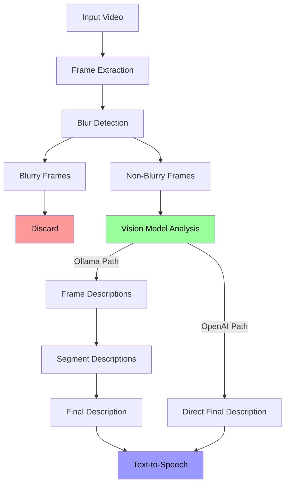

# OSIRIS Video Sage 🎥 🤖

https://github.com/deonblaauw/OSIRIS/assets/readme_vid.mp4

A powerful video analysis tool that uses AI vision models (OpenAI or Ollama) to provide detailed descriptions of video content, with text-to-speech output.

## Features

- 🎥 Intelligent video frame extraction with blur detection
- 🤖 Dual AI model support:
  - OpenAI GPT-4 Vision for comprehensive analysis
  - Ollama's local vision models for privacy-focused analysis
- 🗣️ Text-to-speech narration of video descriptions
- 📊 Detailed JSON output of analysis results
- 🖼️ Organized frame storage with blur detection
- ⚡ Configurable frame sampling rate and batch processing

## Architecture



The video analysis pipeline follows these steps:

1. **Frame Extraction**: Video is processed to extract frames at specified intervals
2. **Blur Detection**: Each frame is analyzed for blur using Laplacian variance
3. **Frame Selection**: Blurry frames are discarded, clear frames proceed
4. **Vision Model Analysis**: 
   - **OpenAI Path**: All frames are analyzed together for a direct final description
   - **Ollama Path**: Each frame is analyzed individually, then combined into segments
5. **Description Generation**:
   - Individual frame descriptions are combined into segment descriptions
   - Segment descriptions are combined into a final video description
6. **Text-to-Speech**: Final description is converted to speech

## Installation

1. Clone the repository:
```bash
git clone https://github.com/deonblaauw/OSIRIS.git
cd OSIRIS/Ollama-VideoSage
```

2. Install dependencies:
```bash
pip install opencv-python numpy tqdm edge-tts openai
```

3. Set up your AI backend:
   - For OpenAI: Set your API key in environment variables
     ```bash
     export OPENAI_API_KEY='your-api-key'
     ```
   - For Ollama: Install Ollama and pull required models
     ```bash
     ollama pull minicpm-v
     ollama pull command-r7b
     ```

## Usage

Run the script with a video file:
```bash
python vision.py your_video.mp4
```

The script will:
1. Extract frames from the video
2. Filter out blurry frames
3. Analyze frames using the selected AI model
4. Generate a comprehensive description
5. Speak the description using text-to-speech

## Configuration

Edit the config dictionary in `vision.py` to customize:

```python
config = {
    "fps_sample_rate": 5,    # Analyze 1 frame every 5 seconds
    "batch_size": 8,         # Frames per segment for Ollama
    "blur_threshold": 4,     # Blur detection sensitivity
    
    # AI Models
    "vision_model": "gpt-4o-mini",  # or "minicpm-v:latest" for Ollama
    "text_model": "command-r7b:latest",
    "use_openai": True,      # True for OpenAI, False for Ollama
}
```

## Output

The script creates an `analysis_output` directory containing:
- `images/`: Extracted non-blurry frames
- `blurry/`: Detected blurry frames
- `analysis_results.json`: Complete analysis data

## Requirements

- Python 3.8+
- OpenCV
- NumPy
- Edge-TTS
- OpenAI API key (if using OpenAI)
- Ollama (if using local models)

## License

MIT License

Copyright (c) 2024 Deon Blaauw

Permission is hereby granted, free of charge, to any person obtaining a copy
of this software and associated documentation files (the "Software"), to deal
in the Software without restriction, including without limitation the rights
to use, copy, modify, merge, publish, distribute, sublicense, and/or sell
copies of the Software, and to permit persons to whom the Software is
furnished to do so, subject to the following conditions:

The above copyright notice and this permission notice shall be included in all
copies or substantial portions of the Software.

THE SOFTWARE IS PROVIDED "AS IS", WITHOUT WARRANTY OF ANY KIND, EXPRESS OR
IMPLIED, INCLUDING BUT NOT LIMITED TO THE WARRANTIES OF MERCHANTABILITY,
FITNESS FOR A PARTICULAR PURPOSE AND NONINFRINGEMENT. IN NO EVENT SHALL THE
AUTHORS OR COPYRIGHT HOLDERS BE LIABLE FOR ANY CLAIM, DAMAGES OR OTHER
LIABILITY, WHETHER IN AN ACTION OF CONTRACT, TORT OR OTHERWISE, ARISING FROM,
OUT OF OR IN CONNECTION WITH THE SOFTWARE OR THE USE OR OTHER DEALINGS IN THE
SOFTWARE.
